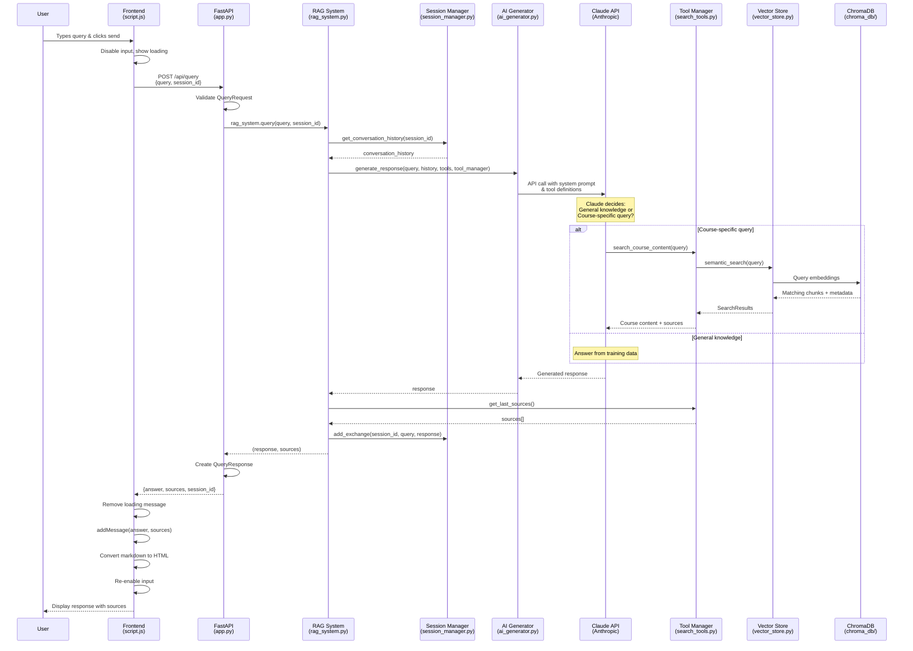

# Query Flow Diagram



## Component Architecture

```mermaid
graph TB
    subgraph "Frontend Layer"
        UI[HTML/CSS/JS Interface]
        Script[script.js - Event Handlers]
    end
    
    subgraph "API Layer"
        FastAPI[FastAPI App<br/>app.py]
        Routes["/api/query<br/>/api/courses"]
    end
    
    subgraph "RAG System Core"
        RAGSys[RAG System<br/>rag_system.py]
        Session[Session Manager<br/>session_manager.py]
    end
    
    subgraph "AI Processing"
        AIGen[AI Generator<br/>ai_generator.py]
        Claude[Claude API<br/>Anthropic]
    end
    
    subgraph "Search & Tools"
        Tools[Tool Manager<br/>search_tools.py]
        SearchTool[Course Search Tool]
    end
    
    subgraph "Data Layer"
        Vector[Vector Store<br/>vector_store.py]
        ChromaDB[(ChromaDB<br/>Embeddings)]
        Docs[Course Documents<br/>docs/ folder]
    end
    
    subgraph "Processing"
        DocProc[Document Processor<br/>document_processor.py]
        Models[Data Models<br/>models.py]
    end

    UI --> Script
    Script -->|POST /api/query| FastAPI
    FastAPI --> RAGSys
    RAGSys --> Session
    RAGSys --> AIGen
    AIGen --> Claude
    Claude -->|Tool calls| Tools
    Tools --> SearchTool
    SearchTool --> Vector
    Vector --> ChromaDB
    
    Docs --> DocProc
    DocProc --> Models
    Models --> Vector
    
    Style UI fill:#e1f5fe
    Style FastAPI fill:#f3e5f5
    Style RAGSys fill:#e8f5e8
    Style Claude fill:#fff3e0
    Style ChromaDB fill:#fce4ec
```

## Data Flow Summary

1. **User Input** → Frontend captures and validates
2. **API Request** → FastAPI receives and routes
3. **RAG Processing** → Orchestrates components
4. **AI Decision** → Claude determines search necessity
5. **Vector Search** → ChromaDB semantic lookup (if needed)
6. **Response Generation** → Claude synthesizes answer
7. **Session Update** → Conversation history stored
8. **Frontend Display** → Markdown rendered with sources